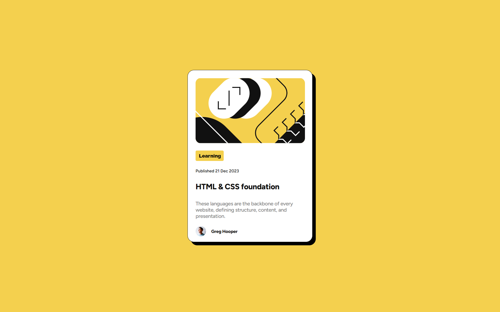
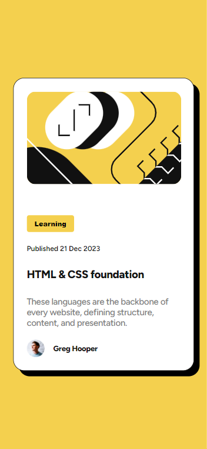

# Frontend Mentor - Blog preview card solution

This is a solution to the [Blog preview card challenge on Frontend Mentor](https://www.frontendmentor.io/challenges/blog-preview-card-ckPaj01IcS). Frontend Mentor challenges help you improve your coding skills by building realistic projects. 

## Table of contents

- [Overview](#overview)
  - [The challenge](#the-challenge)
  - [Screenshot](#screenshot)
  - [Links](#links)
- [My process](#my-process)
  - [Built with](#built-with)
  - [Useful resources](#useful-resources)
- [Author](#author)


## Overview
A reponsive blog post design using html and css. 

### The challenge

Users should be able to:

- See hover and focus states for all interactive elements on the page

### Screenshot





### Links

- Solution URL: [My solution URL](https://github.com/sanyomor-01/blog-preview-card-main)
- Live Site URL: [The live site URL here](https://blog-preview-card-main-rho-rust.vercel.app/)

## My process
- Card structured with semantic html tags
- Then proceeded with the styling using pure css


### Built with

- Semantic HTML5 markup
- CSS custom properties
- Flexbox
- CSS Grid
- Mobile-first workflow
### What I learned
I learnt the use of box-shadows and how it differs  from border-width. All these are applied in css styling
The box-shadow takes up 5 values, that's four length values and a color.
This the code snippest.

```html
<div>Some HTML code I'm proud of</div>
```
```css
.div {
  box-shadow: 8px 8px 0 0 rgba(0, 0, 0, 1);
}
```


### Useful resources

- [Box-shadow](https://developer.mozilla.org/en-US/docs/Web/CSS/box-shadowm) - This is a doc on box-shadow from mdn.
- [Example resource 2](https://www.example.com) - This is an amazing article which helped me finally understand XYZ. I'd recommend it to anyone still learning this concept.


## Author

- Website - [Michael](https://www.github.com/sanyomor-01)
- Frontend Mentor - [@sanyomor-01](https://www.frontendmentor.io/profile/sanyomor-01)
- Twitter - [@sanyo_mor](https://www.twitter.com/sanyo_mor)


